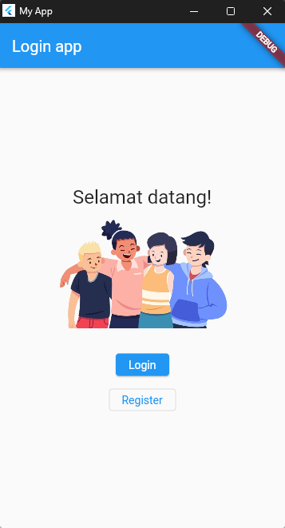
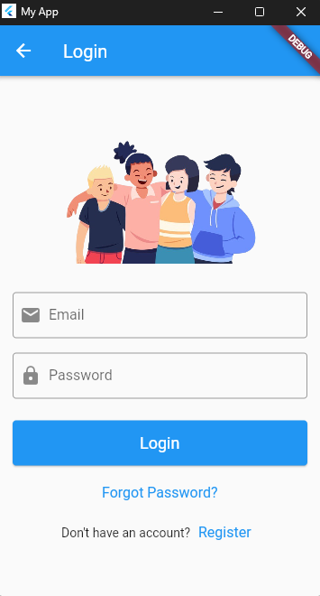
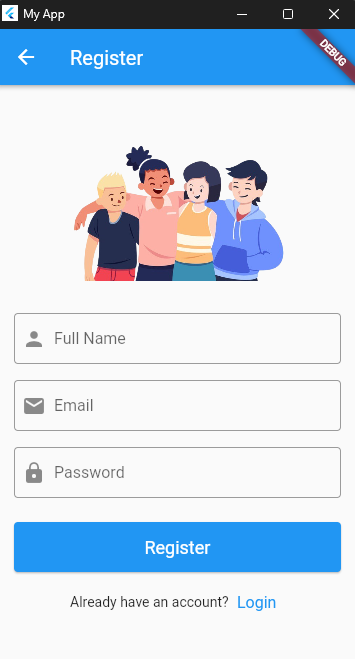

# UTS MOBILE FLUTTER (Login & Register)

**_Nama: Revano Arya Saputra_**  
**_Nim : 312010488_**  
**_Kelas : TI.20.A3_**  

 

## Introduction

Tugas Login Page pada Flutter untuk menyediakan antarmuka pengguna yang memungkinkan pengguna memasukkan kredensial mereka, seperti nama pengguna dan kata sandi, untuk mengakses aplikasi atau layanan tertentu

 

## Screenshots

 

### UI Design Figma

  
  
  

